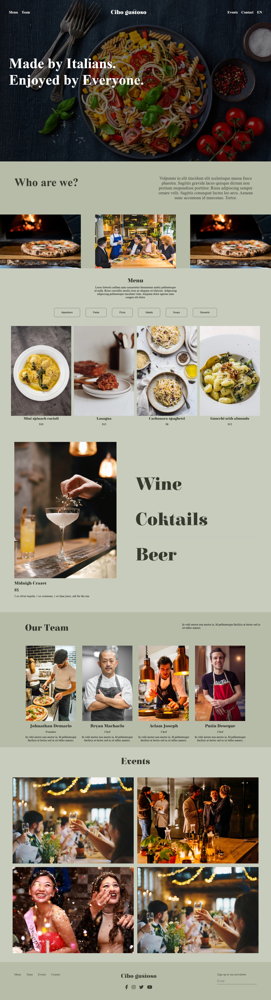

# 🍝 Cibo Gustoso - Restaurant Website

Cibo Gustoso is a modern and responsive Italian restaurant website designed to showcase the restaurant's menu, team, events, and food & beverage offerings. The website provides a clean and visually appealing interface for visitors to explore the restaurant and its services.

## 📸 Screenshot



## 🛠️ Technologies Used

- HTML
- CSS

## ✨ Features

- 🍝 Attractive restaurant homepage
- 👨‍🍳 Our Team section
- 🍕 Menu section with food items and prices
- 🍷 Drinks and cocktails section
- 🎉 Events section
- 📱 Responsive design
- 🖼️ Image-based food and restaurant showcase
- 🧭 Simple navigation menu
- 📩 Newsletter subscription section

## 📦 Dependencies

This project does not require any external npm dependencies.

The website is built using:

- HTML
- CSS

## ⚙️ How to Run Locally

### 1. Clone the repository

```bash
git clone https://github.com/Sadiya646/restaurant-website.git
